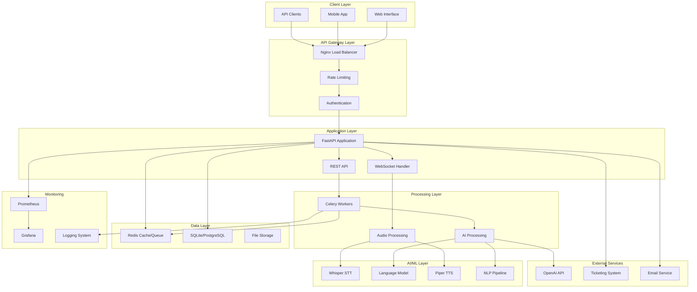
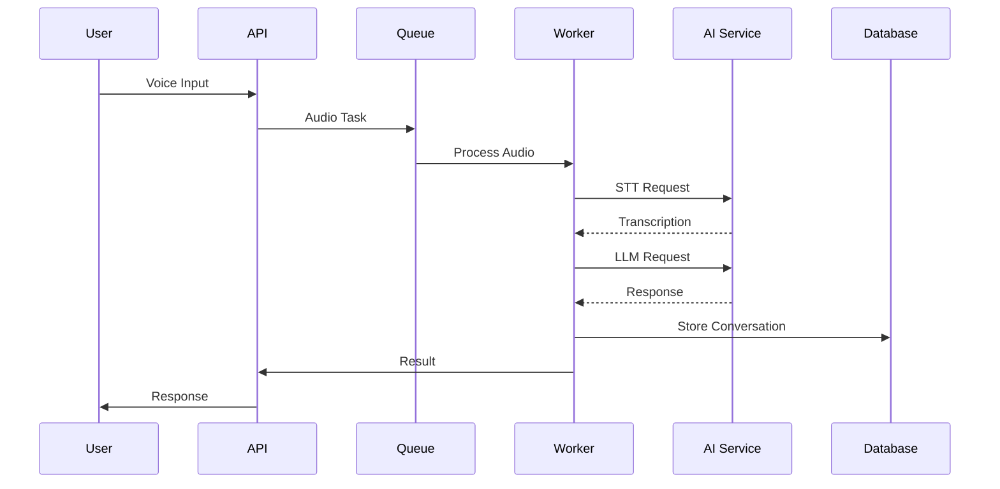
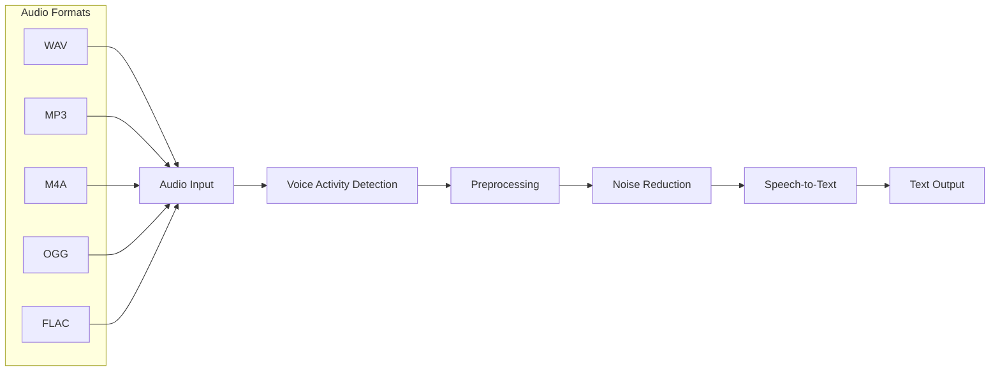
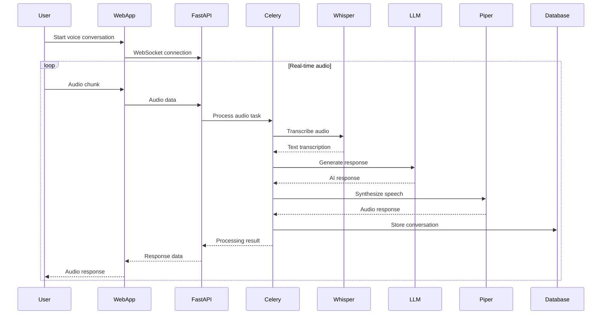
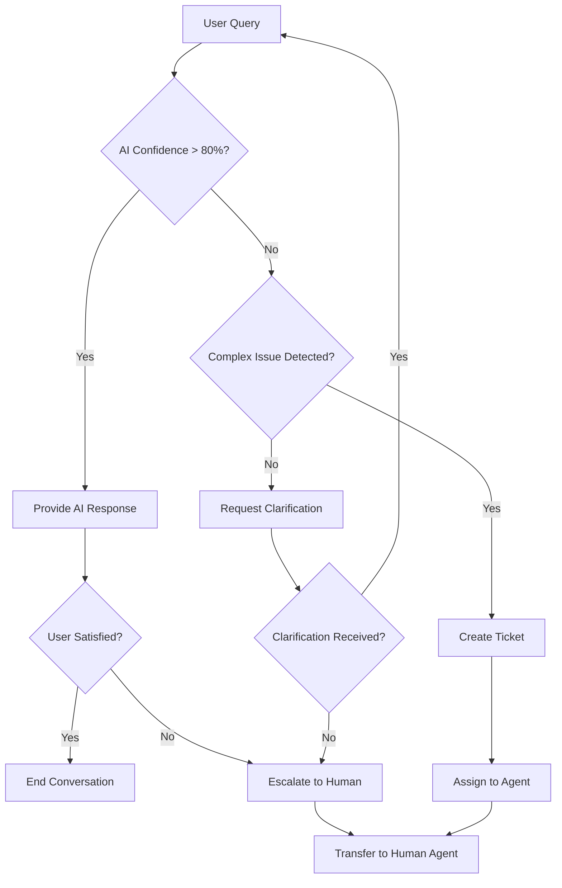
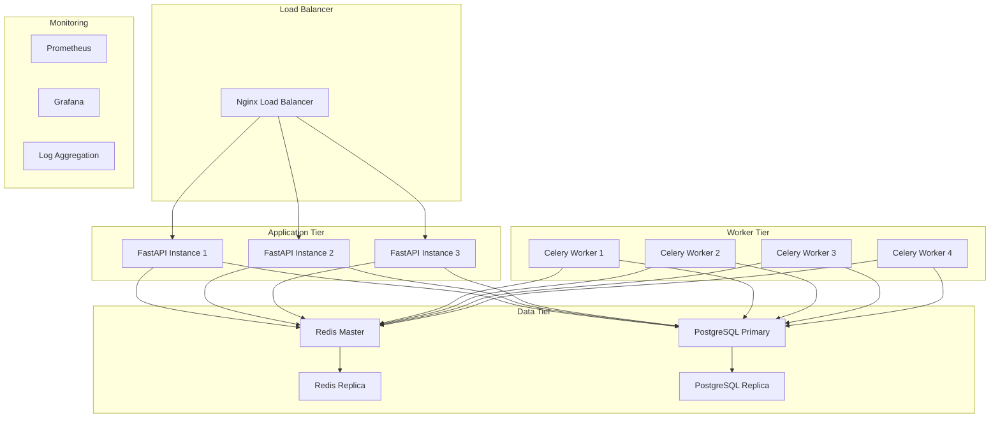
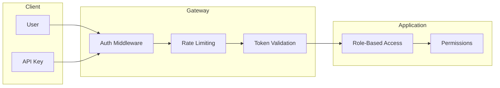

# VoiceHelpDeskAI Architecture Overview

## Table of Contents
1. [System Overview](#system-overview)
2. [Architecture Patterns](#architecture-patterns)
3. [Component Architecture](#component-architecture)
4. [Data Flow](#data-flow)
5. [Technology Stack](#technology-stack)
6. [Deployment Architecture](#deployment-architecture)
7. [Security Architecture](#security-architecture)
8. [Scalability Considerations](#scalability-considerations)

## System Overview

VoiceHelpDeskAI is a comprehensive AI-powered voice help desk system that provides automated customer support through natural language conversation. The system processes voice inputs, understands user intent, and provides intelligent responses while seamlessly escalating to human agents when necessary.

### High-Level Architecture



## Architecture Patterns

### 1. Microservices Architecture
The system follows a microservices pattern with clear separation of concerns:

- **API Layer**: FastAPI application handling HTTP/WebSocket requests
- **Processing Layer**: Celery workers for background tasks
- **AI Layer**: Modular AI components for different capabilities
- **Data Layer**: Redis for caching/queues, database for persistence

### 2. Event-Driven Architecture


### 3. Layered Architecture
```
┌─────────────────────────────────────┐
│           Presentation Layer        │ ← Web UI, Mobile, API
├─────────────────────────────────────┤
│             Business Logic          │ ← FastAPI, Controllers
├─────────────────────────────────────┤
│           Processing Layer          │ ← Celery, Background Tasks
├─────────────────────────────────────┤
│             AI/ML Layer             │ ← Models, NLP, Audio
├─────────────────────────────────────┤
│             Data Layer              │ ← Database, Cache, Files
└─────────────────────────────────────┘
```

## Component Architecture

### Core Application Components

#### 1. FastAPI Application (`src/voicehelpdeskai/main.py`)
```python
# Application structure
app/
├── api/                    # API endpoints
├── core/                   # Core business logic
├── models/                 # Database models
├── services/              # Business services
├── utils/                 # Utilities
└── config/                # Configuration
```

**Responsibilities:**
- HTTP/WebSocket request handling
- Authentication and authorization
- Request validation and response formatting
- Real-time audio streaming
- API documentation

#### 2. Audio Processing Pipeline


**Features:**
- Multi-format audio support (WAV, MP3, M4A, OGG, FLAC)
- Real-time streaming processing
- Voice Activity Detection (VAD)
- Noise reduction (optional)
- Audio quality assessment

#### 3. AI/ML Components

##### Speech-to-Text (Whisper)
```python
# Whisper integration
class WhisperSTT:
    def __init__(self, model_name: str = "base"):
        self.model = whisper.load_model(model_name)
    
    def transcribe(self, audio: np.ndarray) -> TranscriptionResult:
        result = self.model.transcribe(audio)
        return TranscriptionResult(
            text=result["text"],
            confidence=result.get("confidence", 0.0),
            language=result.get("language", "en")
        )
```

##### Language Model Integration
```python
# LLM integration
class LLMProcessor:
    def __init__(self, provider: str = "openai"):
        self.provider = provider
        self.client = self._get_client()
    
    async def generate_response(self, context: ConversationContext) -> LLMResponse:
        prompt = self._build_prompt(context)
        response = await self.client.chat.completions.create(
            model="gpt-3.5-turbo",
            messages=prompt,
            max_tokens=150
        )
        return LLMResponse(
            text=response.choices[0].message.content,
            tokens_used=response.usage.total_tokens
        )
```

##### Text-to-Speech (Piper)
```python
# Piper TTS integration
class PiperTTS:
    def __init__(self, model_path: str):
        self.model = self._load_model(model_path)
    
    def synthesize(self, text: str) -> AudioResponse:
        audio_data = self.model.synthesize(text)
        return AudioResponse(
            audio=audio_data,
            format="wav",
            sample_rate=22050
        )
```

#### 4. Background Processing (Celery)
```python
# Celery task structure
@celery_app.task(bind=True)
def process_audio_conversation(self, audio_data: bytes, session_id: str):
    try:
        # Audio processing pipeline
        transcription = transcribe_audio(audio_data)
        response = generate_llm_response(transcription.text)
        audio_response = synthesize_speech(response.text)
        
        # Store conversation
        store_conversation(session_id, transcription, response)
        
        return {
            'transcription': transcription.text,
            'response': response.text,
            'audio_url': upload_audio(audio_response)
        }
    except Exception as exc:
        self.retry(countdown=60, max_retries=3)
```

### Data Architecture

#### 1. Database Schema
```sql
-- Conversations table
CREATE TABLE conversations (
    id UUID PRIMARY KEY,
    session_id VARCHAR(255) NOT NULL,
    user_input TEXT,
    transcription TEXT,
    ai_response TEXT,
    confidence_score FLOAT,
    created_at TIMESTAMP DEFAULT CURRENT_TIMESTAMP,
    updated_at TIMESTAMP DEFAULT CURRENT_TIMESTAMP
);

-- Sessions table
CREATE TABLE sessions (
    id UUID PRIMARY KEY,
    user_id VARCHAR(255),
    channel VARCHAR(50),
    status VARCHAR(20),
    started_at TIMESTAMP,
    ended_at TIMESTAMP,
    metadata JSONB
);

-- Tickets table (if integrated)
CREATE TABLE tickets (
    id UUID PRIMARY KEY,
    conversation_id UUID REFERENCES conversations(id),
    ticket_number VARCHAR(50),
    priority VARCHAR(20),
    status VARCHAR(20),
    created_at TIMESTAMP
);
```

#### 2. Redis Data Structures
```python
# Session management
session:{session_id} -> {
    "user_id": "user123",
    "channel": "web",
    "context": {...},
    "ttl": 3600
}

# Audio processing queue
audio:queue -> [
    {"audio_id": "audio123", "session_id": "session456"},
    {"audio_id": "audio124", "session_id": "session457"}
]

# Cache responses
cache:response:{hash} -> {
    "response": "...",
    "confidence": 0.95,
    "ttl": 300
}
```

## Data Flow

### 1. Voice Conversation Flow


### 2. Ticket Escalation Flow


## Technology Stack

### Backend Technologies
- **Framework**: FastAPI 0.104+
- **Language**: Python 3.11+
- **Task Queue**: Celery with Redis broker
- **Database**: SQLite (dev) / PostgreSQL (prod)
- **Caching**: Redis
- **AI Models**: 
  - Whisper (OpenAI) for STT
  - GPT-3.5/4 for conversations
  - Piper for TTS

### Infrastructure
- **Containerization**: Docker & Docker Compose
- **Web Server**: Nginx (reverse proxy)
- **Monitoring**: Prometheus + Grafana
- **Logging**: Loguru + Sentry
- **File Storage**: Local filesystem / S3-compatible

### Development Tools
- **Testing**: pytest, asyncio
- **Code Quality**: Black, flake8, mypy
- **Documentation**: Sphinx, OpenAPI
- **CI/CD**: GitHub Actions (ready)

## Deployment Architecture

### Development Environment
```yaml
# docker-compose.yml structure
services:
  app:                    # FastAPI application
  celery-worker:         # Background workers
  celery-beat:           # Scheduled tasks
  redis:                 # Cache and message broker
  nginx:                 # Reverse proxy
  prometheus:            # Metrics collection
  grafana:              # Monitoring dashboard
```

### Production Architecture


## Security Architecture

### Authentication & Authorization


### Data Security
- **Encryption**: TLS 1.3 for all communications
- **Secrets**: Environment variables, HashiCorp Vault ready
- **Audio Data**: Temporary storage, automatic cleanup
- **PII Protection**: Data masking in logs
- **Access Control**: Role-based permissions

### Security Monitoring
```python
# Security event logging
@security_monitor
def track_authentication_attempt(user_id: str, success: bool, ip: str):
    event = SecurityEvent(
        event_type="authentication",
        user_id=user_id,
        success=success,
        source_ip=ip,
        timestamp=datetime.utcnow()
    )
    security_logger.log(event)
```

## Scalability Considerations

### Horizontal Scaling
- **Stateless Design**: All application instances are stateless
- **Load Balancing**: Nginx with upstream configuration
- **Session Storage**: Redis-based session management
- **File Storage**: S3-compatible object storage

### Performance Optimization
```python
# Caching strategy
class ResponseCache:
    def __init__(self, redis_client):
        self.redis = redis_client
        self.default_ttl = 300  # 5 minutes
    
    async def get_cached_response(self, query_hash: str) -> Optional[str]:
        return await self.redis.get(f"response:{query_hash}")
    
    async def cache_response(self, query_hash: str, response: str):
        await self.redis.setex(
            f"response:{query_hash}", 
            self.default_ttl, 
            response
        )
```

### Resource Management
- **Model Loading**: Lazy loading, memory management
- **Audio Processing**: Streaming, chunked processing
- **Database**: Connection pooling, query optimization
- **Background Tasks**: Priority queues, worker scaling

### Monitoring & Alerting
```python
# Performance monitoring
@metrics.timer("api_request_duration")
@metrics.counter("api_requests_total")
async def api_endpoint():
    # Endpoint logic
    pass

# Resource monitoring
@background_task
async def monitor_system_resources():
    cpu_usage = psutil.cpu_percent()
    memory_usage = psutil.virtual_memory().percent
    
    if cpu_usage > 80:
        alert_manager.send_alert("high_cpu_usage", cpu_usage)
    
    if memory_usage > 85:
        alert_manager.send_alert("high_memory_usage", memory_usage)
```

## Integration Points

### External APIs
1. **OpenAI API**: Language model integration
2. **Ticketing Systems**: ServiceNow, Jira, Zendesk
3. **Email Services**: SMTP, SendGrid, AWS SES
4. **Authentication**: LDAP, OAuth2, SAML

### Webhook Support
```python
# Webhook configuration
class WebhookConfig:
    url: str
    events: List[str]  # conversation_started, ticket_created, etc.
    headers: Dict[str, str]
    retry_policy: RetryPolicy
```

### API Integration
```python
# External service integration
class TicketingService:
    async def create_ticket(self, conversation: Conversation) -> Ticket:
        ticket_data = {
            "summary": conversation.summary,
            "description": conversation.transcript,
            "priority": conversation.priority,
            "user_info": conversation.user_context
        }
        
        response = await self.http_client.post(
            f"{self.base_url}/api/tickets",
            json=ticket_data,
            headers=self.auth_headers
        )
        
        return Ticket.from_response(response.json())
```

---

## Next Steps

1. **Performance Testing**: Load testing with realistic voice data
2. **Security Audit**: Penetration testing and security review
3. **High Availability**: Multi-region deployment strategy
4. **Disaster Recovery**: Backup and recovery procedures
5. **Compliance**: GDPR, SOC2, HIPAA readiness assessment

For detailed implementation guides, see:
- [Deployment Guide](deployment.md)
- [Configuration Reference](configuration.md)
- [API Documentation](api.md)
- [Troubleshooting Guide](troubleshooting.md)