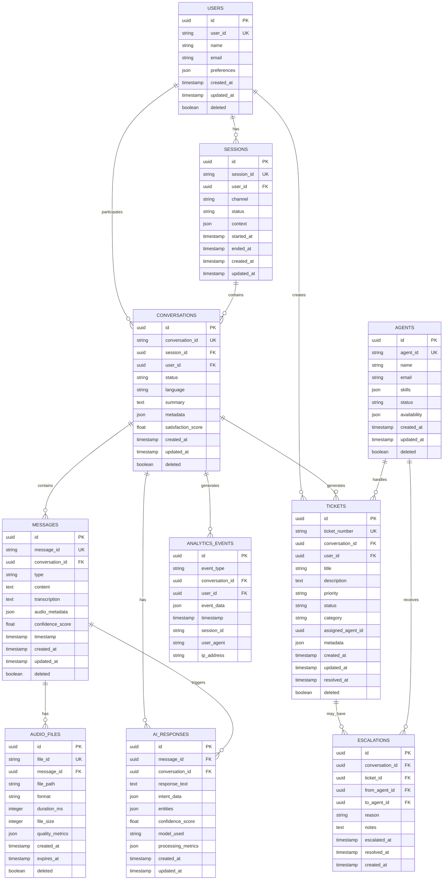

# Database Schema Documentation

## Table of Contents
1. [Overview](#overview)
2. [Schema Design](#schema-design)
3. [Table Definitions](#table-definitions)
4. [Relationships](#relationships)
5. [Indexes](#indexes)
6. [Data Types](#data-types)
7. [Migration Scripts](#migration-scripts)
8. [Performance Considerations](#performance-considerations)

## Overview

VoiceHelpDeskAI uses a relational database schema designed for high performance and scalability. The system supports both SQLite for development and PostgreSQL for production environments.

### Database Features
- **ACID Compliance**: Full transaction support
- **JSON Support**: For flexible metadata storage
- **UUID Primary Keys**: For distributed system compatibility
- **Audit Trails**: Timestamp tracking for all records
- **Soft Deletes**: Logical deletion for data retention

### Supported Databases
- **Development**: SQLite 3.35+
- **Production**: PostgreSQL 13+
- **Testing**: In-memory SQLite

## Schema Design

### Design Principles
1. **Normalization**: 3NF normalized structure
2. **Performance**: Optimized indexes for common queries
3. **Flexibility**: JSON columns for dynamic data
4. **Scalability**: Partitioning-ready design
5. **Audit**: Complete audit trail capability

### Database Diagram


## Table Definitions

### Users Table
Stores user profile information and preferences.

```sql
CREATE TABLE users (
    id UUID PRIMARY KEY DEFAULT gen_random_uuid(),
    user_id VARCHAR(255) UNIQUE NOT NULL,
    name VARCHAR(255),
    email VARCHAR(255),
    phone VARCHAR(50),
    language VARCHAR(10) DEFAULT 'en',
    timezone VARCHAR(50) DEFAULT 'UTC',
    preferences JSONB DEFAULT '{}',
    metadata JSONB DEFAULT '{}',
    created_at TIMESTAMP WITH TIME ZONE DEFAULT CURRENT_TIMESTAMP,
    updated_at TIMESTAMP WITH TIME ZONE DEFAULT CURRENT_TIMESTAMP,
    last_active TIMESTAMP WITH TIME ZONE,
    deleted BOOLEAN DEFAULT FALSE
);

-- Indexes
CREATE INDEX idx_users_user_id ON users(user_id) WHERE NOT deleted;
CREATE INDEX idx_users_email ON users(email) WHERE NOT deleted;
CREATE INDEX idx_users_last_active ON users(last_active);
CREATE INDEX idx_users_created_at ON users(created_at);
```

### Sessions Table
Manages user sessions and context.

```sql
CREATE TABLE sessions (
    id UUID PRIMARY KEY DEFAULT gen_random_uuid(),
    session_id VARCHAR(255) UNIQUE NOT NULL,
    user_id UUID REFERENCES users(id),
    channel VARCHAR(50) NOT NULL, -- 'web', 'mobile', 'api', 'phone'
    status VARCHAR(20) DEFAULT 'active', -- 'active', 'completed', 'expired'
    context JSONB DEFAULT '{}',
    ip_address INET,
    user_agent TEXT,
    started_at TIMESTAMP WITH TIME ZONE DEFAULT CURRENT_TIMESTAMP,
    ended_at TIMESTAMP WITH TIME ZONE,
    expires_at TIMESTAMP WITH TIME ZONE,
    created_at TIMESTAMP WITH TIME ZONE DEFAULT CURRENT_TIMESTAMP,
    updated_at TIMESTAMP WITH TIME ZONE DEFAULT CURRENT_TIMESTAMP
);

-- Indexes
CREATE INDEX idx_sessions_session_id ON sessions(session_id);
CREATE INDEX idx_sessions_user_id ON sessions(user_id);
CREATE INDEX idx_sessions_status ON sessions(status);
CREATE INDEX idx_sessions_started_at ON sessions(started_at);
CREATE INDEX idx_sessions_expires_at ON sessions(expires_at);
```

### Conversations Table
Core conversation records.

```sql
CREATE TABLE conversations (
    id UUID PRIMARY KEY DEFAULT gen_random_uuid(),
    conversation_id VARCHAR(255) UNIQUE NOT NULL,
    session_id UUID REFERENCES sessions(id),
    user_id UUID REFERENCES users(id),
    status VARCHAR(20) DEFAULT 'active', -- 'active', 'completed', 'escalated', 'abandoned'
    language VARCHAR(10) DEFAULT 'en',
    summary TEXT,
    issue_type VARCHAR(100),
    resolution_type VARCHAR(100),
    satisfaction_score DECIMAL(3,2), -- 1.00 to 5.00
    duration_seconds INTEGER,
    message_count INTEGER DEFAULT 0,
    ai_confidence_avg DECIMAL(5,4),
    escalation_reason VARCHAR(255),
    metadata JSONB DEFAULT '{}',
    created_at TIMESTAMP WITH TIME ZONE DEFAULT CURRENT_TIMESTAMP,
    updated_at TIMESTAMP WITH TIME ZONE DEFAULT CURRENT_TIMESTAMP,
    completed_at TIMESTAMP WITH TIME ZONE,
    deleted BOOLEAN DEFAULT FALSE
);

-- Indexes
CREATE INDEX idx_conversations_conversation_id ON conversations(conversation_id) WHERE NOT deleted;
CREATE INDEX idx_conversations_session_id ON conversations(session_id) WHERE NOT deleted;
CREATE INDEX idx_conversations_user_id ON conversations(user_id) WHERE NOT deleted;
CREATE INDEX idx_conversations_status ON conversations(status) WHERE NOT deleted;
CREATE INDEX idx_conversations_created_at ON conversations(created_at) WHERE NOT deleted;
CREATE INDEX idx_conversations_issue_type ON conversations(issue_type) WHERE NOT deleted;
CREATE INDEX idx_conversations_satisfaction_score ON conversations(satisfaction_score) WHERE NOT deleted;
```

### Messages Table
Individual messages within conversations.

```sql
CREATE TABLE messages (
    id UUID PRIMARY KEY DEFAULT gen_random_uuid(),
    message_id VARCHAR(255) UNIQUE NOT NULL,
    conversation_id UUID REFERENCES conversations(id),
    type VARCHAR(50) NOT NULL, -- 'user_audio', 'user_text', 'ai_response', 'agent_message', 'system_message'
    content TEXT,
    transcription TEXT,
    original_audio_url VARCHAR(500),
    response_audio_url VARCHAR(500),
    audio_metadata JSONB DEFAULT '{}', -- duration, format, size, quality_score
    confidence_score DECIMAL(5,4),
    processing_time_ms INTEGER,
    model_used VARCHAR(100),
    language VARCHAR(10),
    intent VARCHAR(100),
    entities JSONB DEFAULT '[]',
    metadata JSONB DEFAULT '{}',
    timestamp TIMESTAMP WITH TIME ZONE DEFAULT CURRENT_TIMESTAMP,
    created_at TIMESTAMP WITH TIME ZONE DEFAULT CURRENT_TIMESTAMP,
    updated_at TIMESTAMP WITH TIME ZONE DEFAULT CURRENT_TIMESTAMP,
    deleted BOOLEAN DEFAULT FALSE
);

-- Indexes
CREATE INDEX idx_messages_message_id ON messages(message_id) WHERE NOT deleted;
CREATE INDEX idx_messages_conversation_id ON messages(conversation_id) WHERE NOT deleted;
CREATE INDEX idx_messages_type ON messages(type) WHERE NOT deleted;
CREATE INDEX idx_messages_timestamp ON messages(timestamp) WHERE NOT deleted;
CREATE INDEX idx_messages_intent ON messages(intent) WHERE NOT deleted;
CREATE INDEX idx_messages_confidence_score ON messages(confidence_score) WHERE NOT deleted;
```

### AI_Responses Table
Detailed AI response analytics.

```sql
CREATE TABLE ai_responses (
    id UUID PRIMARY KEY DEFAULT gen_random_uuid(),
    message_id UUID REFERENCES messages(id),
    conversation_id UUID REFERENCES conversations(id),
    response_text TEXT NOT NULL,
    intent_data JSONB DEFAULT '{}',
    entities JSONB DEFAULT '[]',
    confidence_score DECIMAL(5,4),
    model_used VARCHAR(100),
    model_version VARCHAR(50),
    prompt_tokens INTEGER,
    completion_tokens INTEGER,
    total_tokens INTEGER,
    processing_metrics JSONB DEFAULT '{}', -- latency, memory_usage, etc.
    escalation_recommended BOOLEAN DEFAULT FALSE,
    escalation_confidence DECIMAL(5,4),
    created_at TIMESTAMP WITH TIME ZONE DEFAULT CURRENT_TIMESTAMP,
    updated_at TIMESTAMP WITH TIME ZONE DEFAULT CURRENT_TIMESTAMP
);

-- Indexes
CREATE INDEX idx_ai_responses_message_id ON ai_responses(message_id);
CREATE INDEX idx_ai_responses_conversation_id ON ai_responses(conversation_id);
CREATE INDEX idx_ai_responses_model_used ON ai_responses(model_used);
CREATE INDEX idx_ai_responses_confidence_score ON ai_responses(confidence_score);
CREATE INDEX idx_ai_responses_created_at ON ai_responses(created_at);
```

### Tickets Table
Support ticket management.

```sql
CREATE TABLE tickets (
    id UUID PRIMARY KEY DEFAULT gen_random_uuid(),
    ticket_number VARCHAR(50) UNIQUE NOT NULL,
    conversation_id UUID REFERENCES conversations(id),
    user_id UUID REFERENCES users(id),
    title VARCHAR(255) NOT NULL,
    description TEXT,
    priority VARCHAR(20) DEFAULT 'medium', -- 'low', 'medium', 'high', 'critical'
    status VARCHAR(20) DEFAULT 'open', -- 'open', 'in_progress', 'resolved', 'closed'
    category VARCHAR(100),
    subcategory VARCHAR(100),
    assigned_agent_id UUID REFERENCES agents(id),
    estimated_resolution_time INTERVAL,
    actual_resolution_time INTERVAL,
    first_response_time INTERVAL,
    customer_satisfaction DECIMAL(3,2),
    resolution_summary TEXT,
    metadata JSONB DEFAULT '{}',
    created_at TIMESTAMP WITH TIME ZONE DEFAULT CURRENT_TIMESTAMP,
    updated_at TIMESTAMP WITH TIME ZONE DEFAULT CURRENT_TIMESTAMP,
    resolved_at TIMESTAMP WITH TIME ZONE,
    closed_at TIMESTAMP WITH TIME ZONE,
    deleted BOOLEAN DEFAULT FALSE
);

-- Indexes
CREATE INDEX idx_tickets_ticket_number ON tickets(ticket_number) WHERE NOT deleted;
CREATE INDEX idx_tickets_conversation_id ON tickets(conversation_id) WHERE NOT deleted;
CREATE INDEX idx_tickets_user_id ON tickets(user_id) WHERE NOT deleted;
CREATE INDEX idx_tickets_assigned_agent_id ON tickets(assigned_agent_id) WHERE NOT deleted;
CREATE INDEX idx_tickets_status ON tickets(status) WHERE NOT deleted;
CREATE INDEX idx_tickets_priority ON tickets(priority) WHERE NOT deleted;
CREATE INDEX idx_tickets_category ON tickets(category) WHERE NOT deleted;
CREATE INDEX idx_tickets_created_at ON tickets(created_at) WHERE NOT deleted;
```

### Audio_Files Table
Audio file metadata and storage information.

```sql
CREATE TABLE audio_files (
    id UUID PRIMARY KEY DEFAULT gen_random_uuid(),
    file_id VARCHAR(255) UNIQUE NOT NULL,
    message_id UUID REFERENCES messages(id),
    file_path VARCHAR(500) NOT NULL,
    original_filename VARCHAR(255),
    mime_type VARCHAR(100),
    format VARCHAR(20), -- 'wav', 'mp3', 'm4a', 'ogg', 'flac'
    duration_ms INTEGER,
    file_size INTEGER, -- bytes
    sample_rate INTEGER,
    channels INTEGER,
    bit_depth INTEGER,
    quality_metrics JSONB DEFAULT '{}', -- snr, clarity_score, etc.
    processing_status VARCHAR(20) DEFAULT 'pending', -- 'pending', 'processed', 'failed'
    storage_location VARCHAR(100), -- 'local', 's3', 'gcs'
    checksum VARCHAR(64),
    created_at TIMESTAMP WITH TIME ZONE DEFAULT CURRENT_TIMESTAMP,
    expires_at TIMESTAMP WITH TIME ZONE,
    deleted BOOLEAN DEFAULT FALSE
);

-- Indexes
CREATE INDEX idx_audio_files_file_id ON audio_files(file_id) WHERE NOT deleted;
CREATE INDEX idx_audio_files_message_id ON audio_files(message_id) WHERE NOT deleted;
CREATE INDEX idx_audio_files_format ON audio_files(format) WHERE NOT deleted;
CREATE INDEX idx_audio_files_processing_status ON audio_files(processing_status) WHERE NOT deleted;
CREATE INDEX idx_audio_files_expires_at ON audio_files(expires_at) WHERE NOT deleted;
```

### Agents Table
Human agent information.

```sql
CREATE TABLE agents (
    id UUID PRIMARY KEY DEFAULT gen_random_uuid(),
    agent_id VARCHAR(255) UNIQUE NOT NULL,
    name VARCHAR(255) NOT NULL,
    email VARCHAR(255) UNIQUE NOT NULL,
    phone VARCHAR(50),
    department VARCHAR(100),
    role VARCHAR(100),
    skills JSONB DEFAULT '[]', -- ['technical', 'billing', 'sales']
    languages JSONB DEFAULT '["en"]',
    status VARCHAR(20) DEFAULT 'active', -- 'active', 'busy', 'away', 'offline'
    availability JSONB DEFAULT '{}', -- schedule, timezone, etc.
    performance_metrics JSONB DEFAULT '{}',
    created_at TIMESTAMP WITH TIME ZONE DEFAULT CURRENT_TIMESTAMP,
    updated_at TIMESTAMP WITH TIME ZONE DEFAULT CURRENT_TIMESTAMP,
    last_active TIMESTAMP WITH TIME ZONE,
    deleted BOOLEAN DEFAULT FALSE
);

-- Indexes
CREATE INDEX idx_agents_agent_id ON agents(agent_id) WHERE NOT deleted;
CREATE INDEX idx_agents_email ON agents(email) WHERE NOT deleted;
CREATE INDEX idx_agents_status ON agents(status) WHERE NOT deleted;
CREATE INDEX idx_agents_department ON agents(department) WHERE NOT deleted;
```

### Escalations Table
Escalation tracking.

```sql
CREATE TABLE escalations (
    id UUID PRIMARY KEY DEFAULT gen_random_uuid(),
    conversation_id UUID REFERENCES conversations(id),
    ticket_id UUID REFERENCES tickets(id),
    from_agent_id UUID REFERENCES agents(id),
    to_agent_id UUID REFERENCES agents(id),
    escalation_type VARCHAR(50), -- 'complexity', 'workload', 'expertise', 'priority'
    reason VARCHAR(255),
    notes TEXT,
    urgency VARCHAR(20) DEFAULT 'normal', -- 'low', 'normal', 'high', 'critical'
    auto_escalated BOOLEAN DEFAULT FALSE,
    escalated_at TIMESTAMP WITH TIME ZONE DEFAULT CURRENT_TIMESTAMP,
    acknowledged_at TIMESTAMP WITH TIME ZONE,
    resolved_at TIMESTAMP WITH TIME ZONE,
    created_at TIMESTAMP WITH TIME ZONE DEFAULT CURRENT_TIMESTAMP
);

-- Indexes
CREATE INDEX idx_escalations_conversation_id ON escalations(conversation_id);
CREATE INDEX idx_escalations_ticket_id ON escalations(ticket_id);
CREATE INDEX idx_escalations_to_agent_id ON escalations(to_agent_id);
CREATE INDEX idx_escalations_escalated_at ON escalations(escalated_at);
CREATE INDEX idx_escalations_urgency ON escalations(urgency);
```

### Analytics_Events Table
Event tracking for analytics.

```sql
CREATE TABLE analytics_events (
    id UUID PRIMARY KEY DEFAULT gen_random_uuid(),
    event_type VARCHAR(100) NOT NULL,
    conversation_id UUID REFERENCES conversations(id),
    user_id UUID REFERENCES users(id),
    session_id VARCHAR(255),
    event_data JSONB DEFAULT '{}',
    timestamp TIMESTAMP WITH TIME ZONE DEFAULT CURRENT_TIMESTAMP,
    user_agent TEXT,
    ip_address INET,
    country_code VARCHAR(2),
    city VARCHAR(100),
    referrer VARCHAR(500),
    page_url VARCHAR(500)
);

-- Indexes (Partitioned by timestamp)
CREATE INDEX idx_analytics_events_event_type ON analytics_events(event_type, timestamp);
CREATE INDEX idx_analytics_events_conversation_id ON analytics_events(conversation_id);
CREATE INDEX idx_analytics_events_user_id ON analytics_events(user_id);
CREATE INDEX idx_analytics_events_timestamp ON analytics_events(timestamp);

-- Partitioning (PostgreSQL)
-- CREATE TABLE analytics_events_2024_01 PARTITION OF analytics_events
-- FOR VALUES FROM ('2024-01-01') TO ('2024-02-01');
```

## Relationships

### Key Relationships
1. **User → Sessions**: One-to-many (user can have multiple sessions)
2. **Session → Conversations**: One-to-many (session can contain multiple conversations)
3. **Conversation → Messages**: One-to-many (conversation contains multiple messages)
4. **Message → Audio Files**: One-to-many (message can have multiple audio files)
5. **Conversation → Tickets**: One-to-one or one-to-many (conversation may generate tickets)
6. **Ticket → Escalations**: One-to-many (ticket can be escalated multiple times)

### Foreign Key Constraints
```sql
-- Add foreign key constraints with proper cascade behavior
ALTER TABLE sessions ADD CONSTRAINT fk_sessions_user_id 
    FOREIGN KEY (user_id) REFERENCES users(id) ON DELETE SET NULL;

ALTER TABLE conversations ADD CONSTRAINT fk_conversations_session_id 
    FOREIGN KEY (session_id) REFERENCES sessions(id) ON DELETE CASCADE;

ALTER TABLE conversations ADD CONSTRAINT fk_conversations_user_id 
    FOREIGN KEY (user_id) REFERENCES users(id) ON DELETE SET NULL;

ALTER TABLE messages ADD CONSTRAINT fk_messages_conversation_id 
    FOREIGN KEY (conversation_id) REFERENCES conversations(id) ON DELETE CASCADE;

ALTER TABLE ai_responses ADD CONSTRAINT fk_ai_responses_message_id 
    FOREIGN KEY (message_id) REFERENCES messages(id) ON DELETE CASCADE;

ALTER TABLE tickets ADD CONSTRAINT fk_tickets_conversation_id 
    FOREIGN KEY (conversation_id) REFERENCES conversations(id) ON DELETE SET NULL;

ALTER TABLE audio_files ADD CONSTRAINT fk_audio_files_message_id 
    FOREIGN KEY (message_id) REFERENCES messages(id) ON DELETE CASCADE;
```

## Indexes

### Performance Indexes
```sql
-- Composite indexes for common queries
CREATE INDEX idx_conversations_user_status_date ON conversations(user_id, status, created_at) WHERE NOT deleted;
CREATE INDEX idx_messages_conv_type_timestamp ON messages(conversation_id, type, timestamp) WHERE NOT deleted;
CREATE INDEX idx_tickets_agent_status_priority ON tickets(assigned_agent_id, status, priority) WHERE NOT deleted;

-- JSON field indexes (PostgreSQL GIN indexes)
CREATE INDEX idx_users_preferences_gin ON users USING GIN (preferences);
CREATE INDEX idx_conversations_metadata_gin ON conversations USING GIN (metadata);
CREATE INDEX idx_messages_entities_gin ON messages USING GIN (entities);
CREATE INDEX idx_ai_responses_intent_gin ON ai_responses USING GIN (intent_data);

-- Text search indexes
CREATE INDEX idx_messages_content_fts ON messages USING GIN (to_tsvector('english', content)) WHERE NOT deleted;
CREATE INDEX idx_tickets_title_description_fts ON tickets USING GIN (to_tsvector('english', title || ' ' || description)) WHERE NOT deleted;
```

### Unique Constraints
```sql
-- Business logic unique constraints
ALTER TABLE users ADD CONSTRAINT uk_users_user_id UNIQUE (user_id);
ALTER TABLE sessions ADD CONSTRAINT uk_sessions_session_id UNIQUE (session_id);
ALTER TABLE conversations ADD CONSTRAINT uk_conversations_conversation_id UNIQUE (conversation_id);
ALTER TABLE messages ADD CONSTRAINT uk_messages_message_id UNIQUE (message_id);
ALTER TABLE tickets ADD CONSTRAINT uk_tickets_ticket_number UNIQUE (ticket_number);
ALTER TABLE audio_files ADD CONSTRAINT uk_audio_files_file_id UNIQUE (file_id);
ALTER TABLE agents ADD CONSTRAINT uk_agents_agent_id UNIQUE (agent_id);
ALTER TABLE agents ADD CONSTRAINT uk_agents_email UNIQUE (email);
```

## Data Types

### PostgreSQL Specific Types
```sql
-- Use PostgreSQL specific types for better performance
ALTER TABLE sessions ALTER COLUMN ip_address TYPE INET;
ALTER TABLE analytics_events ALTER COLUMN ip_address TYPE INET;

-- Use JSONB for better query performance
ALTER TABLE users ALTER COLUMN preferences TYPE JSONB;
ALTER TABLE conversations ALTER COLUMN metadata TYPE JSONB;
ALTER TABLE messages ALTER COLUMN audio_metadata TYPE JSONB;
ALTER TABLE messages ALTER COLUMN entities TYPE JSONB;

-- Use proper timestamp types
ALTER TABLE users ALTER COLUMN created_at TYPE TIMESTAMP WITH TIME ZONE;
ALTER TABLE conversations ALTER COLUMN created_at TYPE TIMESTAMP WITH TIME ZONE;
```

### SQLite Compatibility
```sql
-- SQLite doesn't support all PostgreSQL types, use compatible alternatives
-- INET → TEXT
-- JSONB → TEXT (with JSON validation in application)
-- TIMESTAMP WITH TIME ZONE → TIMESTAMP (store as UTC)
-- UUID → TEXT (use UUID library in application)

-- Example SQLite schema
CREATE TABLE users_sqlite (
    id TEXT PRIMARY KEY DEFAULT (lower(hex(randomblob(16)))),
    user_id TEXT UNIQUE NOT NULL,
    preferences TEXT DEFAULT '{}' CHECK (json_valid(preferences)),
    created_at TIMESTAMP DEFAULT CURRENT_TIMESTAMP
);
```

## Migration Scripts

### Initial Schema Creation
```sql
-- 001_create_initial_schema.sql
BEGIN;

-- Create extensions (PostgreSQL only)
CREATE EXTENSION IF NOT EXISTS "uuid-ossp";
CREATE EXTENSION IF NOT EXISTS "pg_trgm";

-- Create tables in dependency order
\i tables/001_users.sql
\i tables/002_agents.sql
\i tables/003_sessions.sql
\i tables/004_conversations.sql
\i tables/005_messages.sql
\i tables/006_ai_responses.sql
\i tables/007_tickets.sql
\i tables/008_audio_files.sql
\i tables/009_escalations.sql
\i tables/010_analytics_events.sql

-- Create indexes
\i indexes/001_primary_indexes.sql
\i indexes/002_performance_indexes.sql
\i indexes/003_text_search_indexes.sql

-- Create functions and triggers
\i functions/001_update_timestamp.sql
\i triggers/001_update_timestamps.sql

COMMIT;
```

### Update Timestamp Trigger
```sql
-- functions/001_update_timestamp.sql
CREATE OR REPLACE FUNCTION update_updated_at_column()
RETURNS TRIGGER AS $$
BEGIN
    NEW.updated_at = CURRENT_TIMESTAMP;
    RETURN NEW;
END;
$$ language 'plpgsql';

-- triggers/001_update_timestamps.sql
CREATE TRIGGER update_users_updated_at BEFORE UPDATE ON users
    FOR EACH ROW EXECUTE FUNCTION update_updated_at_column();

CREATE TRIGGER update_conversations_updated_at BEFORE UPDATE ON conversations
    FOR EACH ROW EXECUTE FUNCTION update_updated_at_column();

-- Repeat for all tables with updated_at column
```

### Data Migration Examples
```sql
-- 002_add_satisfaction_scoring.sql
BEGIN;

-- Add new columns
ALTER TABLE conversations ADD COLUMN satisfaction_score DECIMAL(3,2);
ALTER TABLE conversations ADD COLUMN satisfaction_method VARCHAR(50);

-- Backfill existing data
UPDATE conversations 
SET satisfaction_score = 3.5, satisfaction_method = 'estimated'
WHERE status = 'completed' AND satisfaction_score IS NULL;

-- Add indexes
CREATE INDEX idx_conversations_satisfaction_score 
ON conversations(satisfaction_score) WHERE NOT deleted;

COMMIT;
```

## Performance Considerations

### Query Optimization
```sql
-- Optimized conversation history query
EXPLAIN (ANALYZE, BUFFERS) 
SELECT c.conversation_id, c.status, c.created_at,
       COUNT(m.id) as message_count,
       AVG(m.confidence_score) as avg_confidence
FROM conversations c
LEFT JOIN messages m ON c.id = m.conversation_id AND NOT m.deleted
WHERE c.user_id = $1 AND NOT c.deleted
  AND c.created_at >= $2
GROUP BY c.id, c.conversation_id, c.status, c.created_at
ORDER BY c.created_at DESC
LIMIT 50;

-- Use covering indexes for better performance
CREATE INDEX idx_conversations_user_history_covering 
ON conversations(user_id, created_at DESC) 
INCLUDE (conversation_id, status) 
WHERE NOT deleted;
```

### Partitioning Strategy
```sql
-- Partition analytics_events by month for better performance
CREATE TABLE analytics_events (
    id UUID PRIMARY KEY DEFAULT gen_random_uuid(),
    event_type VARCHAR(100) NOT NULL,
    timestamp TIMESTAMP WITH TIME ZONE DEFAULT CURRENT_TIMESTAMP,
    -- other columns...
) PARTITION BY RANGE (timestamp);

-- Create monthly partitions
CREATE TABLE analytics_events_2024_01 PARTITION OF analytics_events
FOR VALUES FROM ('2024-01-01') TO ('2024-02-01');

CREATE TABLE analytics_events_2024_02 PARTITION OF analytics_events
FOR VALUES FROM ('2024-02-01') TO ('2024-03-01');
```

### Archival Strategy
```sql
-- Archive old conversations (older than 2 years)
CREATE TABLE conversations_archive (LIKE conversations INCLUDING ALL);

-- Move old data
WITH moved_conversations AS (
    DELETE FROM conversations 
    WHERE created_at < CURRENT_TIMESTAMP - INTERVAL '2 years'
    RETURNING *
)
INSERT INTO conversations_archive SELECT * FROM moved_conversations;
```

### Connection Pooling
```python
# Application-level configuration
DATABASE_CONFIG = {
    'pool_size': 20,
    'max_overflow': 30,
    'pool_timeout': 30,
    'pool_recycle': 3600,
    'pool_pre_ping': True
}
```

---

## Maintenance Scripts

### Cleanup Old Data
```sql
-- cleanup_old_data.sql
-- Delete expired audio files
DELETE FROM audio_files 
WHERE expires_at < CURRENT_TIMESTAMP AND expires_at IS NOT NULL;

-- Delete old analytics events (older than 1 year)
DELETE FROM analytics_events 
WHERE timestamp < CURRENT_TIMESTAMP - INTERVAL '1 year';

-- Update statistics
ANALYZE;
```

### Health Check Queries
```sql
-- Check table sizes
SELECT schemaname, tablename, 
       pg_size_pretty(pg_total_relation_size(schemaname||'.'||tablename)) as size
FROM pg_tables 
WHERE schemaname = 'public'
ORDER BY pg_total_relation_size(schemaname||'.'||tablename) DESC;

-- Check index usage
SELECT schemaname, tablename, indexname, idx_tup_read, idx_tup_fetch
FROM pg_stat_user_indexes 
ORDER BY idx_tup_read DESC;

-- Check slow queries
SELECT query, mean_time, calls, total_time
FROM pg_stat_statements 
ORDER BY mean_time DESC 
LIMIT 10;
```

For more information, see:
- [Migration Guide](../deployment/migrations.md)
- [Performance Tuning](performance.md)
- [Backup & Recovery](backup.md)